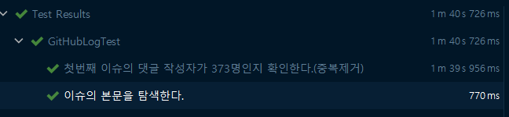
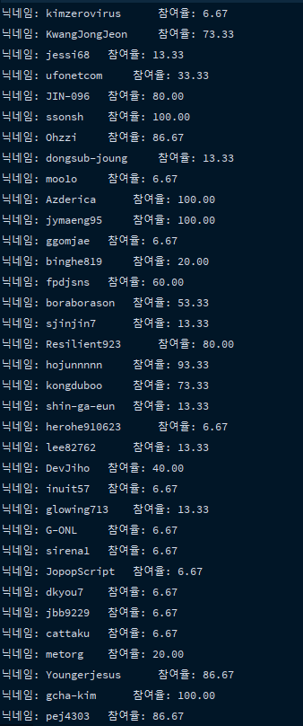

# Github 대쉬보드 만들기

- [x] 깃헙 이슈 1번부터 15번까지 댓글을 순회하며 댓글을 남긴 사용자를 체크
- [x] 참여율 % 표현



---

## [Github 자바 라이브러리](https://github-api.kohsuke.org/dependency-info.html)
- 사용한 인증방식: connect via `Personal access token`
<br>
  
## [Personal Access Token](https://docs.github.com/en/github/authenticating-to-github/creating-a-personal-access-token)

--- 

---

## JUnit5 테스트코드 에러

```shell
FAILURE: Build failed with an exception.
* What went wrong:
Execution failed for task ':test'.
> There were failing tests. See the report at: file:///C:/Users/psh/Documents/Web/github-dashboard/build/reports/tests/test/index.html
* Try:
Run with --stacktrace option to get the stack trace. Run with --info or --debug option to get more log output. Run with --scan to get full insights.
* Get more help at https://help.gradle.org
```
## 해결법
```shell
Now that we've specified the platform, we need to supply the JUnit dependencies. 

This is where we see a noteworthy difference between JUnit 5 and earlier versions.

See, with earlier versions, we only needed one dependency🌏. 

In JUnit 5, though, the API is separated from the runtime, meaning two dependencies💥.
The API is manifest with junit-jupiter-api. The runtime is junit-jupiter-engine for JUnit 5, and junit-vintage-engine for JUnit 3 or 4.

We'll supply these two in testImplementation and timeRuntimeOnly, respectively:

```
출처: https://www.baeldung.com/junit-5-gradle

----

# 참고 저장소

- [whiteship-live-statistic by honux77](https://github.com/honux77/whiteship-live-statistic/tree/main/github-dashboard)
